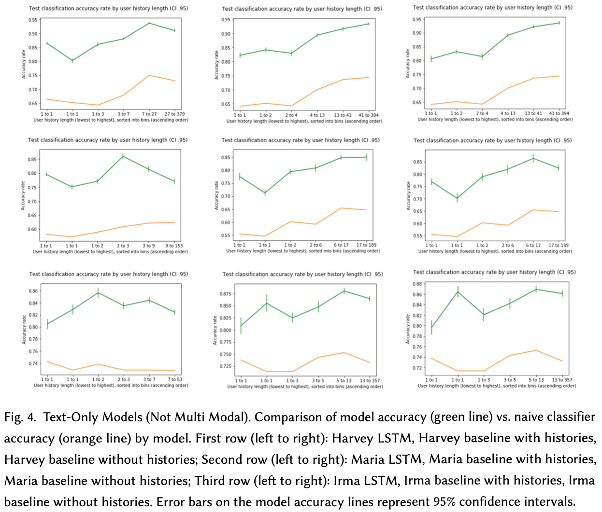

# Identifying Informative Twitter Users During Natural Disasters

Highlights:

* Achieved state-of-the-art accuracies on hurricanes Harvey and Maria in CrisisMMD multimodal human-labeled dataset

* Reframed the problem as predicting informative tweets in a sequence of posts by a user

* Incorporated unlabeled data from Twitter API to augment user tweet histories

* Extracted tf-idf and GloVe language features and ResNet image features

* LSTM and baseline feedforward neural networks in PyTorch

* Voted best project in NLP course

## Abstract

Using machine learning models to identify informative social media posts can aid emergency services during disasters by providing timely situational awareness. We seek to build upon the work in (Nalluru, Pandey, and Purohit 2019), which classifies the informativeness of tweets from natural disasters using labeled multimodal text and images features and achieves accuracy rates of 0.813 to 0.874 and AUC of 0.8801 to 0.9065 across different disaster events. Using the same dataset, we train novel feedforward and LSTM neural networks that incorporate user history context—unlabeled text and images from other posts by the author of the tweet being classified. While our models incorporating user history do not consistently outperform non-history baselines, evidence that our history based models perform better on medium length histories suggests possible improvement using data with longer, consistent-length histories. We achieve accuracy rates of 0.7941 to 0.8799 and AUC of 0.7740 to 0.8914, reaching state-of-the-art accuracy on hurricanes Harvey and Maria.

## Objectives and significance 

In a natural disaster, emergency services have the urgent tasks of searching for people who need help, assessing infrastructural damage, and coordinating volunteer efforts. Enhancing the situational awareness needed for these tasks through information from social media has long been a subject of research (Vieweg et al. 2010). Public platforms such as Twitter enable victims, volunteers, and other informed parties outside of organized institutions to communicate on-the-ground needs and knowledge in real time.

However, identifying informative content amidst an outpouring of media attention, sympathies, and even political statements about the event requires more sophisticated filtering than selecting relevant hashtags (e.g., “#HurricaneMaria”). To this end, many works have sought to filter posts for relevancy and type of disaster-related information using language features within individual micro blog posts (Imran et al. 2013; Yin et al. 2012). Besides text, social media also contains images, and works like (Nguyen et al. 2017) use this data for tasks such as analyzing the extent and type of disaster-related infrastructural damage. Other works have combined images, video, and tweet text in multimodal approaches to disaster situational awareness (Nalluru, Pandey, and Purohit 2019; Pouyanfar, Wang, and Chen 2019)

Building upon new work on the recently released CrisisMMD multimodal dataset(Alam, Ofli, and Imran 2018a), we examine the effect of expanding the window of both image and text features to include a social media user’s whole history of posts during the disaster. We have operationalized the problem as follows: A target tweet and the history of other posts by the author of that tweet are the inputs to our models. These produce a binary classification of the target tweet, indicating whether the tweet is informative to emergency services as an output. Extracting natural language features from the text of tweets was the subject of separate research, while this project focused on extracting image features from a stream of user posts and fusing these with NLP features in a final informativeness classification.

## Background

To our knowledge the only prior work to classify informativeness on the CrisisMMD dataset is (Nalluru, Pandey, and Purohit 2019). Their study argues the effectiveness of a multimodal approach to classifying the informativeness of tweets. In their original report their multimodal models outperform their text-only models by 0.011 - 0.03 in accuracy rate and 0.001 - 0.034 in AUC across three separate disasters. However following the commencement of our research, they have updated their results to correct inconsistent parameters, and the margins between multimodal models and text-only models are now only 0.001 - 0.005 in accuracy rate and 0.0012 - 0.0081 in AUC. Thus we investigate whether these findings can be reproduced by our by non-history baselines, and whether they are improved by the incorporation of user history context.

The approach taken by (Nalluru, Pandey, and Purohit 2019) does not consider context beyond the frame of a single post, and so can serve excellently as a baseline to measure the impact of adding user history information. For features, they extract TF-IDF vectors and mean GloVe word embedding (Pennington, Socher, and Manning 2014) for the text of each tweet and use the last layer of ResNet50(He et al. 2016) to embed images. They use SVD for dimensionality reduction and finally use the concatenated results as inputs to a LightGBM (Ke et al. 2017) classifier. We use similar features in our approach to enable close comparison between our results and theirs.

Our focus on user history draws inspiration from (Zeng et al. 2019), who successfully incorporate user history from Twitter and Reddit posts to predict when users will stay involved in a conversation. In particular, they point out the convenience of user history as a feature that is easily extracted compared to complex features like social network information, allowing this approach to be more easily generalized to a variety of applications. Moreover, they found that F1 scores increased as longer user histories were used. While conversation is a different domain than ours, we investigate the impact of incorporating user history in a new use case.

In the domain of disaster-related Twitter, (Stowe et al. 2016) found that incorporating elements of user history through simple unigram features from the previous two tweets improved F1 scores for classification of relevant posts. A follow-up study by the same team (Stowe et al. 2018) noted difficulty incorporating a wider context window with recurrent neural network approaches. They speculate that, despite manual inspection of the data revealing the importance of past context for understanding a particular tweet, it is possible that useful context does not occur at regular locations within a user history. Thus models would struggle to learn what parts of a history to consider or forget. However (Stowe et al. 2018) are identifying preparation and evacuation behaviors, which we believe may be a problem with much more complex contextual structure than informativeness classification.

With regard to computer vision, much research has gone into learning temporal relationships between frames in video data. While not focused on users-level features, a recent work in multimodal classification of disaster related YouTube clips fuses temporal information from video, audio, and accompanying text descriptions, achieving an 8% increase in MAP likelihood over models from prior frameworks (Pouyanfar, Wang, and Chen 2019).

While frames in a video are far more related than a sequence of images posted over hours or days, work on classifying the contents of photo albums suggests that temporal relationships between distinct images still contain useful information. Such research seeks to label the events of a sequence of images, for instance identifying an album of pictures as a weekend ski trip. The authors of (Sigurdsson, Chen, and Gupta 2016) found that using a skipping recurrent neural network (S-RNN) to learn visual-temporal sequences among images is an effective tactic to summarize groups of photos. Further work by (Bacha, Allili, and Benblidia 2016) used convolutional neural networks (CNNs) to derive object and scene features from photographs, and then combined these extracted features in a probabilistic graphical model to predict album categories. While these works are not directly concerned with a disaster-related domain, they nevertheless support the notion that the combined features of a collection of user curated images can contain sequence and contextual information helpful for predicting a generalization about the group of inputs.

## Methods

To directly compare our models to those of (Nalluru, Pandey, and Purohit 2019), we used the CrisisMMD dataset described in (Alam, Ofli, and Imran 2018a), which includes 16,097 non-identical, human-annotated Twitter posts. Each tweet contains text and one or more images, with a total of 18,126 images among all tweets. These posts were published during seven natural disasters in 2017: Hurricanes Irma, Harvey, and Maria, as well as California wildfires, the Mexico earthquake, the Iraq-Iran earthquake, and Sri Lanka floods. Tweets were selected based upon their use of keywords and hashtags surrounding the disaster, then filtered to posts with English-language text only, and finally organized in the dataset by the disaster event they were pulled from. Tweet text and images were each assigned a high-level classification based on their informativeness for humanitarian aid efforts—either informative, not informative, or don’t know or can’t judge. The authors of the dataset describe their process of harvesting these images in (Alam, Ofli, and Imran 2018b).

The creators of the CrisisMMD dataset (Alam, Ofli, and Imran 2018a) define an "informative" tweet as containing useful information for humanitarian aid efforts. Each tweet has separate informativeness labels for text and each image attached to the tweet. Human annotators were presented with each image or tweet text separately. Informative tweets, (Alam, Ofli, and Imran 2018a) further elaborate, contain information such as: "cautions, advice, and warnings, injured, dead, or affected people, rescue, volunteering, or donation request or effort, damaged houses, damaged roads, damaged buildings; flooded houses, flooded streets; blocked roads, blocked bridges, blocked pathways; any built structure affected by earthquake, fire, heavy rain, strong winds, gust, etc., and disaster area maps." Table 1 contains examples of both informative and non-informative tweets in the dataset.

Further inspection of the labeled dataset found that the mean user history length, or number of tweets per user, in the dataset was lower than 1.25, with a median length of 1. Our judgment was that this was too short a user history length to meaningfully evaluate the effect of considering user histories in our models, particularly given that over half of the tweets’ users had no other tweets recorded in the dataset. To extend user histories, we used the Tweepy Twitter API to extract the full information of tweets for each author in the dataset from a list of unlabeled tweets IDs also included in the CrisisMMD dataset. The unlabeled portion of the dataset contains all of tweets originally retrieved by the dataset’s authors using hashtag and keyword searches during a window of time around the disaster. The labeled dataset was sampled from this much larger collection of tweets. We utilize this unlabeled set of tweets rather than retrieving user histories directly from users timelines because the latter approach requires use of Twitter’s paid historical tweet functionality. Nevertheless our new approach increased the size of the dataset from 16,090 to 145,253 tweets across all events, and increased the mean and median user history lengths to 12.88 and 3 respectively. Table 2 summarizes the resulting increases in user history length from incorporating these unlabeled tweets.

Following the collection of additional data, we processed tweets into feature vectors. All tweet text was transformed to lowercase and stopwords were removed. We follow (Nalluru, Pandey, and Purohit 2019) in using TF-IDF, GloVe word embeddings, and ResNet features in order to measure our results against theirs. We use GloVe word embeddings to generate a representation of a tweet by taking the mean of all the embeddings of the words in the tweet. Additionally we follow their approach in using SVD on these embeddings to ensure that no feature dominates due to quantity. Thus TF-IDF is truncated to the 200 most significant components of an SVD that is fit on the TF-IDF vectors of all labeled and unlabeled tweets occurring in a given training set. This is done to match the dimensionality of the 200 dimensional GloVe embeddings trained on 27 billion tweets that we also follow (Nalluru, Pandey, and Purohit 2019) in using. ResNet features are extracted by following standard image prepossessing (resizing such that its shorter dimension is 256 pixels, cropping around the center to a 224 pixel square, and finally normalizing pixel values by the mean and std values specified for the network) and simply taking the values at the second to last layer of the network as a feature vector. We then apply SVD to truncate this feature vector to 400 dimensions, to give language and image features equal presence in the final concatonated feature vectors made up of TF-IDF, GloVe, and Resnet vectors.

A significant decision we made on the data was how to handle the merging of the text and image informativeness class labels. Because a given tweet can have multiple images (and only one text), it is possible for a tweet to be labeled informative for some of its text and image components but not for others. This was the case for 174 tweets in the Harvey set, 371 for Maria and 172 for Irma, where either the text or the image was deemed informative, but not both. We elect to consider a whole tweet as informative if its text or any of its component images are labeled informative. We believe this would best serve emergency services, who would view the tweet as a whole when utilizing the information. It is important to note though that this increases the class prior of positives in the dataset. The positive class priors for images and tweets separately is already above half, so models already biased by training on such data will further improve on metrics such as accuracy after the merging approach we follow. We have chosen to leave this bias in our training sets, as we have no reason to believe that the dataset does not represent the true proportions of informative tweets that would be gathered this way. Intuitively, this filtering system is intended to work on tweets that are retrieved through keyword and hashtag searches that indicates some baseline relevance, thus it is not surprising that more of these tweets than not are informative. Unfortunately, (Nalluru, Pandey, and Purohit 2019) do not explicitly note their strategy for merging image and text class labels, so it is possible that our approach diverges from theirs.

### Models

To best investigate the effect of incorporating user histories into tweet classification, we compare (1) our primary LSTM model, which classifies a target tweet based on the sequence of tweets by its author up to and including the target tweet, against (2) a baseline that only includes features from the target tweet and (3) another baseline that incorporates user history but ignores the order of the tweets.

1. The LSTM model takes inputs from chronologically sorting the user histories, truncating the history at the target tweet, and extracting the TF-IDF, GloVe, and ResNet feature vectors as previously described. Drawing inspiration from the success of (Zeng et al. 2019) in using bi-directional LSTMs with bi-attention for modeling sequential social media histories, we decided to implement an LSTM as our main model. We implement both bi-directional and uni-directional variants and treat the directionality as a hyperparameter in our optimization search (described in the next section). Due to time constraints we do not implement a bi-attention mechanism. Because each tweet can contain multiple images, the ResNet vectors (already truncated by SVD) of each image in a particular tweet are are fed into a tweet-level LSTM whose final output is concatenated with the TF-IDF and GloVe vectors before being passed in as sequence inputs in a history-level LSTM (see figure 1).

2.	Our simplest baseline mirrors the approach of (Nalluru, Pandey, and Purohit 2019) by considering only the TF-IDF, GloVe, and ResNet feature vectors for a particular target tweet. We classify using a multilayer perceptron (MLP) model following inspiration from the finding of (Stowe et al. 2018) that a multilayer perceptron was a stronger classifier of natural disaster tweets than an SVM baseline. In order to merge all images in a given tweet, we take the mean of each ResNet vector for each image.

3.	Our more complex baseline concatenates the TF-IDF, GloVe, and ResNet feature vectors of the target tweet with mean TF-IDF, GloVe, and ResNet feature vectors derived from the full user history of the author of the target tweet. These mean vectors are formed by first combining all tweet text in the user history of the author being considered into one document. Then for TF-IDF we vectorize the whole combined document, or for GloVe we take the mean embedding of all words in the combined document. For ResNet we take the mean of all images attached to all tweets in the history. Finally we apply SVD to TF-IDF and ResNet vectors to truncate as described in the previous section. Finally the combined target and history feature vectors are the input for classification by a MLP model. This aggregated user history feature allows us to measure the impact of simply including user history features en masse in comparison to learning from the order of those features as our LSTM model attempts.

### Evaluation Strategy

Due to our interest in comparing our model’s success relative to the models created by (Nalluru, Pandey, and Purohit 2019), our primary evaluation metrics for both our baseline and LSTM models were accuracy and AUC. In addition to model accuracy and AUC values, we collected precision, recall, and F1 scores. Further, we compared our model’s average accuracy to the accuracy achieved by a naive classifier that randomly classifies cases as positive with a probability equal to the proportion of positive samples in the train set. To reduce noise from the stochastic gradient training process, we run 25 evaluation trials trained separately on different randomization of the same data for each model and take the average of each evaluation metric on the resulting model. Finally, we examined the impact of user-history length on the success of our predictions by investigating changes in accuracy based on the length of the available history for the tweet being classified. These evaluation methods were proper for calibrating system performance as they allowed for a direct and efficient comparison among our models and those of (Nalluru, Pandey, and Purohit 2019), despite differences in model structure.

### Cross-Validation

In keeping with (Nalluru, Pandey, and Purohit 2019), we break each disaster event in to an 80/20 split for training and evaluation. We further split the 80% partition with ten-fold cross-validation. We devised a strategy that guaranteed an approximately equal number of labeled tweets allocated to each fold while ensuring that tweets by a given user were not separated between different folds by iteratively appending all tweets by a user until reaching the desired fold size. We used our ten-fold cross validation to conduct a randomized hyperparameter search, wherein sets of hyperparameters were sampled uniformly within specified ranges for each hyperparameter (chosen to allow a breadth of possibilities while staying within our computational means). Each set of hyperparameters was used to create models on all 10 folds and the resulting accuracies on the validation sets were averaged. 50 sets were conducted for each model on each event, and the hyperparameter set achieving the highest average accuracy in each was selected for use in evaluation. The hyperparameters for our LSTM model were: number of history-level hidden neurons (50-500), number of image-level hidden neurons (30-200), number of stacked LSTM layers (1- 2), directionality, learning rate (.005-.05), and epochs (1-4). The hyperparameters for our baseline MLPs were all the same with the same ranges except activation function (relu, sigmoid, or tanh) replaces directionality and there is only a single number of hidden neurons (50-500). Hyperparameters for the language-feature-only comparison models where set by a separate search conducted for other research.

## Results

After hyperparameter optimization on 10-fold cross-validation sets consisting of 80% of the data we gather our results on evaluations on the remaining 20% of the data. We rerun these evaluations 25 times each and take the average of all evaluation metrics to minimize noise from stochastic gradient decent. So while each evaluation model trains on the same data, the data is presented to it in a different order.

In Table 3 we present these averaged metrics over the 25 trials for each model and event. The comparable results from (Nalluru, Pandey, and Purohit 2019) are also provided for reference. We also compare our full-multimodal model with a text only models that do not incorporate image features.

In Figures 3 and 4 we further investigate the effect of user-history length on the success of accuracy. We bin data points into 6 groups where each group has 1/6 of the total data points. The groups are organized by the length of the user histories available for that point. Maximum and minimum user history lengths within each bin are noted at the bottom of the figure. Also note that for several events multiple bins contain points with only user histories of length 1, because despite our data augmentation these short histories still make up a large subset of our data. In order to view the increase in accuracy that might be due solely to the increase in positive class priors associated with increasing user history length, we have also plotted the accuracy achieved by a naive classifier that randomly classifies cases as positive with a probability equal to the proportion of positive samples in the train set.

## Conclusions and Future Directions

In this project, we extracted features from both tweet images and text in classifying whether a tweet was informative to emergency services during a natural disaster. In summary, we found that the multimodal fusion of tweet text and image features led to stronger classification results, with non-history multimodal models consistently outperforming text-only counterparts by approximately 0.0065 to 0.0229 in accuracy rate. However, our findings do not show that adding user history information to the models improved accuracy over a whole test set consistently across events. Nevertheless, there is some indication that with increased user history lengths accuracy improves. Due to the limitations of what is freely available through the Twitter API, we were unable to gather consistent and long length user histories for all users appearing in the dataset. We believe that these preliminary results visible in figures 3 and 4 indicate the possibility that model performance could improve further with data including longer histories. While some of this effect is likely due to the correlation between positive class label and longer history leveraging the existing bias, our models outperform such a naive bias based classifier and gains by the classifier do not strictly align with gains by our models in all cases.

These findings indicate that incorporating user histories into classification model is a promising direction for the CrisisMMD classification task. Further, our results show that integrating images with text strengthens classification accuracy. We foresee several future directions that could benefit the performance of the model. First, informative tweets were overrepresented in our dataset, comprising around 70% of all tweets. We did not manipulate the dataset balance due to our interest in directly comparing our findings with those of (Nalluru, Pandey, and Purohit 2019). However, future studies should investigate whether training classifiers on a balanced set of tweets improves classification performance in test sets. Secondly, further work is needed to investigate whether adding an attention mechanism to the LSTM model, and thereby increasing the number of layers, increases model accuracy. Finally, running seven-fold cross-validation in which each fold represents a held-out event from the set of seven natural disasters could test the effectiveness of the model on an entirely held-out event, which could simulate the model’s utility during a new, real-time disaster.

## References

Alam, Firoj, Ferda Ofli, and Muhammad Imran. 2018a. “CrisisMMD: Multimodal Twitter Datasets from Natural Disasters.” CoRR abs/1805.00713. http://arxiv.org/abs/1805.00713.

———. 2018b. “Processing Social Media Images by Combining Human and Machine Computing During Crises.” International Journal of Human–Computer Interaction 34 (4). TaylorFrancis: 311–27. https://doi.org/10.1080/10447318.2018.1427831.

Bacha, Siham, Mohand Said Allili, and Nadjia Benblidia. 2016. “Event Recognition in Photo Albums Using Probabilistic Graphical Models and Feature Relevance.” Journal of Visual Communication and Image Representation 40. Elsevier: 546–58.
He, K., X. Zhang, S. Ren, and J. Sun. 2016. “Deep Residual Learning for Image Recognition.” In 2016 Ieee Conference on Computer Vision and Pattern Recognition (Cvpr), 770–78. https://doi.org/10.1109/CVPR.2016.90.

Imran, Muhammad, Shady Elbassuoni, Carlos Castillo, Fernando Diaz, and Patrick Meier. 2013. “Practical Extraction of Disaster-Relevant Information from Social Media.” In Proceedings of the 22Nd International Conference on World Wide Web, 1021–4. WWW ’13 Companion. New York, NY, USA: ACM. https://doi.org/10.1145/2487788.2488109.

Ke, Guolin, Qi Meng, Thomas Finley, Taifeng Wang, Wei Chen, Weidong Ma, Qiwei Ye, and Tie-Yan Liu. 2017. “LightGBM: A Highly Efficient Gradient Boosting Decision Tree.” In Advances in Neural Information Processing Systems 30, edited by I. Guyon, U. V. Luxburg, S. Bengio, H. Wallach, R. Fergus, S. Vishwanathan, and R. Garnett, 3146–54. Curran Associates, Inc. http://papers.nips.cc/paper/6907-lightgbm-a-highly-efficient-gradient-boosting-decision-tree.pdf.

Nalluru, Ganesh, Rahul Pandey, and Hemant Purohit. 2019. “Relevancy Classification of Multimodal Social Media Streams for Emergency Services.” In IEEE International Conference on Smart Computing, SMARTCOMP 2019, Washington, Dc, Usa, June 12-15, 2019, 121–25. https://doi.org/10.1109/SMARTCOMP.2019.00040.

Nguyen, Dat T, Ferda Ofli, Muhammad Imran, and Prasenjit Mitra. 2017. “Damage Assessment from Social Media Imagery Data During Disasters.” In Proceedings of the 2017 Ieee/Acm International Conference on Advances in Social Networks Analysis and Mining 2017, 569–76. ACM.

Pennington, Jeffrey, Richard Socher, and Christopher Manning. 2014. “Glove: Global Vectors for Word Representation.” In Proceedings of the 2014 Conference on Empirical Methods in Natural Language Processing (EMNLP), 1532–43. Doha, Qatar: Association for Computational Linguistics. https://doi.org/10.3115/v1/D14-1162.

Pouyanfar, Samira, Tianyi Wang, and Shu-Ching Chen. 2019. “Residual Attention-Based Fusion for Video Classification.” In The Ieee Conference on Computer Vision and Pattern Recognition (Cvpr) Workshops.

Sigurdsson, Gunnar A, Xinlei Chen, and Abhinav Gupta. 2016. “Learning Visual Storylines with Skipping Recurrent Neural Networks.” In European Conference on Computer Vision, 71–88. Springer.

Stowe, Kevin, Jennings Anderson, Martha Palmer, Leysia Palen, and Ken Anderson. 2018. “Improving Classification of Twitter Behavior During Hurricane Events.” In Proceedings of the Sixth International Workshop on Natural Language Processing for Social Media, 67–75. Melbourne, Australia: Association for Computational Linguistics. https://doi.org/10.18653/v1/W18-3512.

Stowe, Kevin, Michael J. Paul, Martha Palmer, Leysia Palen, and Kenneth Anderson. 2016. “Identifying and Categorizing Disaster-Related Tweets.” In Proceedings of the Fourth International Workshop on Natural Language Processing for Social Media, 1–6. Austin, TX, USA: Association for Computational Linguistics. https://doi.org/10.18653/v1/W16-6201.

Vieweg, Sarah, Amanda L. Hughes, Kate Starbird, and Leysia Palen. 2010. “Microblogging During Two Natural Hazards Events: What Twitter May Contribute to Situational Awareness.” In Proceedings of the Sigchi Conference on Human Factors in Computing Systems, 1079–88. CHI ’10. New York, NY, USA: ACM. https://doi.org/10.1145/1753326.1753486.

Yin, Jie, Sarvnaz Karimi, Bella Robinson, and Mark Cameron. 2012. “ESA: Emergency Situation Awareness via Microbloggers.” In Proceedings of the 21st Acm International Conference on Information and Knowledge Management, 2701–3. CIKM ’12. New York, NY, USA: ACM. https://doi.org/10.1145/2396761.2398732.

Zeng, Xingshan, Jing Li, Lu Wang, and Kam-Fai Wong. 2019. “Joint Effects of Context and User History for Predicting Online Conversation Re-Entries.” In Proceedings of the 57th Annual Meeting of the Association for Computational Linguistics, 2809–18. Florence, Italy: Association for Computational Linguistics. https://doi.org/10.18653/v1/P19-1270.
